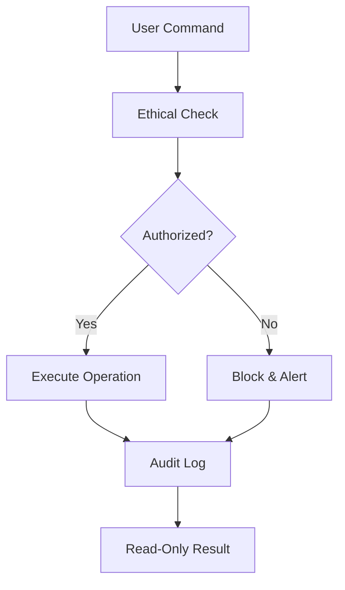

# Falcon v2 - OSINT Toolkit

[](https://www.python.org/downloads/)
[](https://opensource.org/licenses/MIT)
[](https://github.com/6lackRaven/Falcon)

> Keen-eyed intelligence gathering with predatory precision
<p align="center">
  
</p>

Advanced network recon tool built with Python.
Falcon is an advanced OSINT reconnaissance toolkit designed for ethical security researchers and penetration testers. It combines multiple intelligence gathering techniques into a unified platform with strict ethical enforcement mechanisms.

**Important: All files in this repository are read-only to maintain integrity.**

## 🔒 Security Features

- **File Integrity Protection**: All files are marked as read-only
- **Ethical Enforcement**: Blocks government/military targets
- **Audit Logging**: All operations are logged
- **Automatic Updates**: Secure update mechanism

## 🚀 Installation

```bash
# Clone repository (read-only files will preserve permissions)
git clone https://github.com/6lackRaven/Falcon.git

# Install dependencies
cd Falcon
pip install -r requirements.txt

# Make main tool executable (preserves read-only)
chmod +x falcon.py
```

## 🕹️ Usage

```bash
# Username search
./falcon.py -u username

# Email analysis
./falcon.py -e email@example.com

# Domain reconnaissance
./falcon.py -d example.com --vulnerability

# Generate HTML report
./falcon.py -i 8.8.8.8 --report html
```

## 🛡️ Security Model



## 📊 Features
| Module | Command | Description |
|--------|---------|-------------|
| **Username** | `-u` | Search 15+ social platforms |
| **Email** | `-e` | Breach detection + dark web scan |
| **Domain** | `-d` | Full DNS + WHOIS analysis |
| **IP** | `-i` | GeoIP + port scanning |
| **Vulnerability** | `--vulnerability` | Web security checks |
| **Reporting** | `--report` | HTML/JSON output |

## ⚠️ Ethical Notice
> This tool is for **authorized security research only**. Unauthorized use is strictly prohibited. Developers assume no liability for misuse.

---
## Contact

If you have any questions, suggestions, or want to collaborate, feel free to reach out:

- **Email:** harleystanislas.raven@gmail.com
- **GitHub:** [https://github.com/6lackRaven](https://github.com/6lackRaven)
- **FaceBook:** [Harley Stanislas](https://www.facebook.com/profile.php?id=100087273507449)
---

## Support

- ⭐️ Starring the repository
- Sharing the project with your network
- Reporting issues or contributing to the code

## 💸 Crypto Donations (Anonymous Support)

If you find my tools useful — like Falcon and GhostEyes — and want to support my work anonymously, you can donate crypto to any of the following addresses:

- **Bitcoin (BTC):** `bc1qvc8y7z2jguzr7e3fvwyf09l3me94mqk06nz3hj`
- **Ethereum (ETH):** `0x58bc732d4279321f1e4a8ca57ed2ad16ed5a2e15`
- **USDT (ERC20):** `0x58bc732d4279321f1e4a8ca57ed2ad16ed5a2e15`
- **BNB (BEP20):** `0x58bc732d4279321f1e4a8ca57ed2ad16ed5a2e15`
- **Solana (SOL):** `E7x7ak3H6ob2eHbgsbfgVXpEJyVqMPUFPBtkuEUKj2cq`

🙏 Every contribution helps me continue building open-source cybersecurity tools and sharing knowledge with the community. Thank you!
