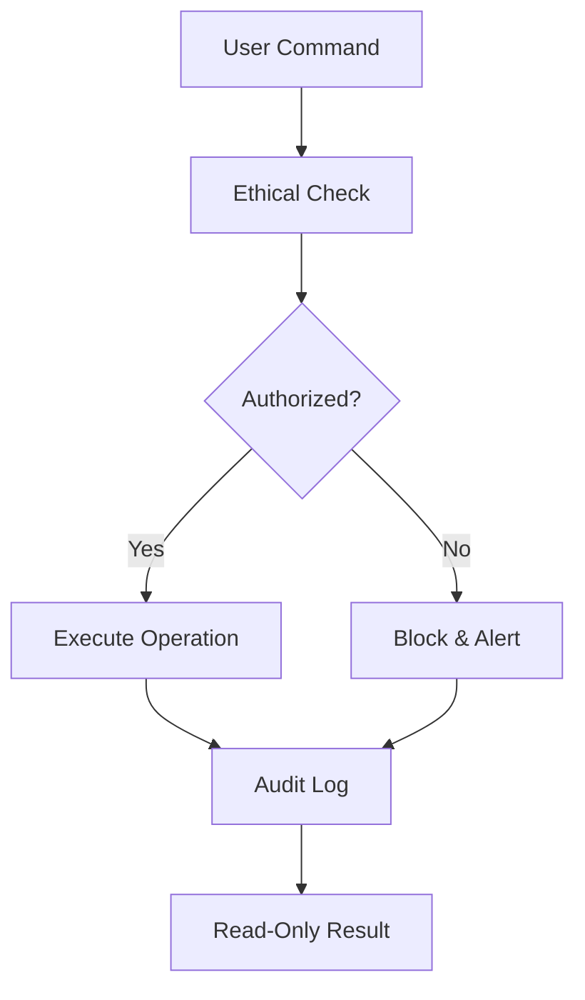

# THIS FILE IS READ-ONLY


<!-- READ-ONLY FILE -->
# 🦅 Falcon OSINT Toolkit

[](https://www.python.org/downloads/)
[](https://opensource.org/licenses/MIT)
[](https://github.com/6lackRaven/Falcon)

> Keen-eyed intelligence gathering with predatory precision

Falcon is an advanced OSINT reconnaissance toolkit designed for ethical security researchers and penetration testers. It combines multiple intelligence gathering techniques into a unified platform with strict ethical enforcement mechanisms.

**Important: All files in this repository are read-only to maintain integrity.**

## 🔒 Security Features

- **File Integrity Protection**: All files are marked as read-only
- **Ethical Enforcement**: Blocks government/military targets
- **Audit Logging**: All operations are logged
- **Automatic Updates**: Secure update mechanism

## 🚀 Installation

```bash
# Clone repository (read-only files will preserve permissions)
git clone https://github.com/6lackRaven/Falcon.git

# Install dependencies
cd Falcon
pip install -r requirements.txt

# Make main tool executable (preserves read-only)
chmod +x falcon.py
```

## 🕹️ Usage

```bash
# Username search
./falcon.py -u username

# Email analysis
./falcon.py -e email@example.com

# Domain reconnaissance
./falcon.py -d example.com --vulnerability

# Generate HTML report
./falcon.py -i 8.8.8.8 --report html
```

## 🛡️ Security Model



## 📊 Features
| Module | Command | Description |
|--------|---------|-------------|
| **Username** | `-u` | Search 15+ social platforms |
| **Email** | `-e` | Breach detection + dark web scan |
| **Domain** | `-d` | Full DNS + WHOIS analysis |
| **IP** | `-i` | GeoIP + port scanning |
| **Vulnerability** | `--vulnerability` | Web security checks |
| **Reporting** | `--report` | HTML/JSON output |

## ⚠️ Ethical Notice
> This tool is for **authorized security research only**. Unauthorized use is strictly prohibited. Developers assume no liability for misuse.

---
